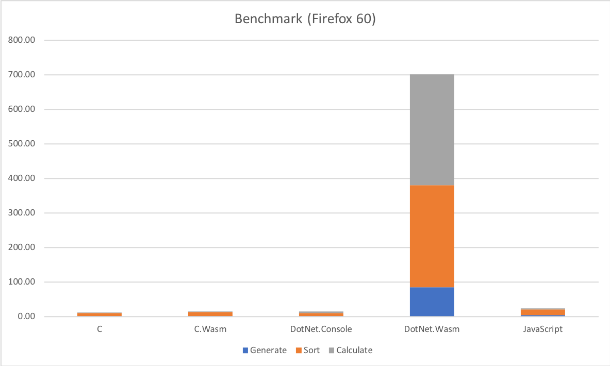

# Current state of mono-wasm/Blazor performance

## Benchmark Information

The Benchmark is currently very simple and only does the following things:

* Generate 100,000 random list elements (from 0.0 to 1.0)
* Sort the list by their values
* Get Q1, Median, Q3 and calculate average and standard deviation

## Platform Information

The Benchmark was implemented in the following languages/platforms:

* .NET Core 2.1.300 (preview2-008533)
* mono-wasm (commit a14f41c from Blazor 0.3.0)
* C (gcc 4.2.1)
* C-wasm (emcc 1.37.36)
* JavaScript (TypeScript 2.8.1)

[mono-wasm with AOT](https://github.com/lrz/mono-wasm) was also attempted, but the project seems not to developed in the open and resulted in either compilation or JIT errors when running.

The .NET Projects where build with `Release` configuration and the C Projects with `-O3` optimizations.

## Results

Chrome 65

|           | C      | C.Wasm   | DotNet.Console   | DotNet.Wasm   | JavaScript   |
|-----------|-------:|---------:|-----------------:|--------------:|-------------:|
| Generate  | 1.21ms |   1.00ms |           1.00ms |      127.00ms |       7.50ms |
| Sort      | 9.05ms |  12.00ms |          26.00ms |      406.00ms |      22.40ms |
| Calculate | 0.21ms |   1.00ms |           4.00ms |      474.00ms |       6.60ms |

Firefox 60

|           | C      | C.Wasm   | DotNet.Console   | DotNet.Wasm   | JavaScript   |
|-----------|-------:|---------:|-----------------:|--------------:|-------------:|
| Generate  | 1.21ms |   1.00ms |           1.00ms |       84.00ms |       4.00ms |
| Sort      | 9.05ms |  12.00ms |          26.00ms |      297.00ms |      16.00ms |
| Calculate | 0.21ms |   1.00ms |           4.00ms |      321.00ms |       4.00ms |

