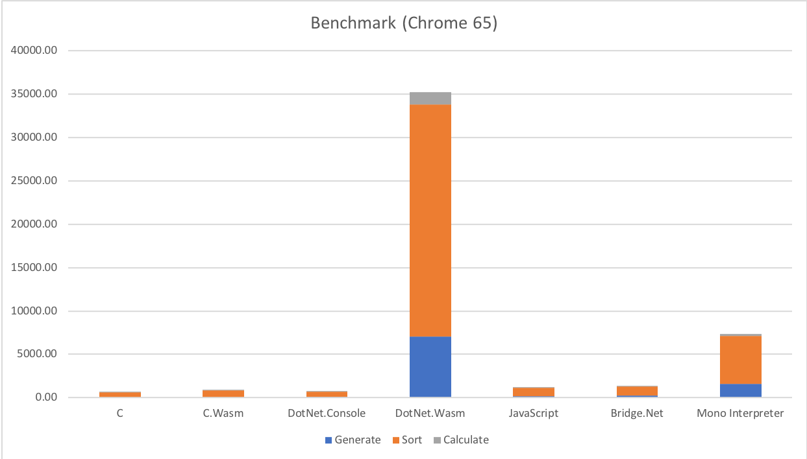
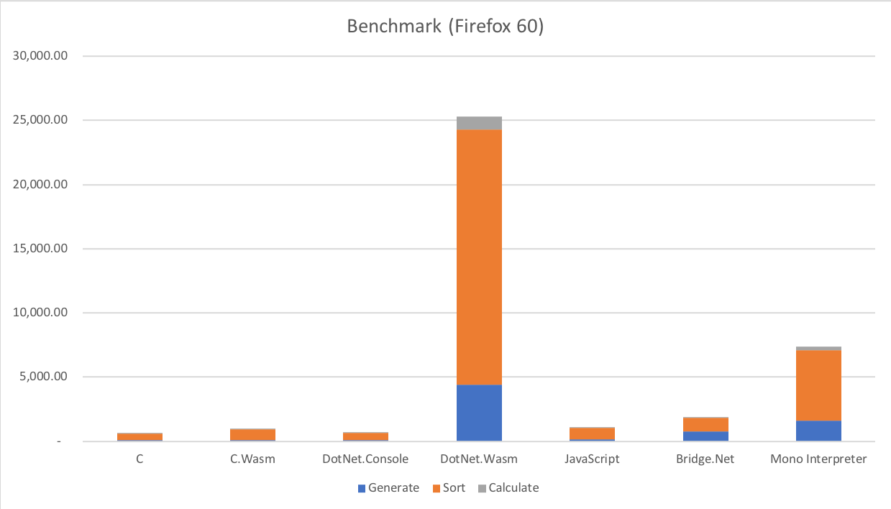

# Current state of mono-wasm/Blazor performance

## Benchmark Information

The Benchmark is currently very simple and only does the following things:

* Generate 5,000,000 random list elements (from 0.0 to 1.0)
* Sort the list by their values
* Get Q1, Median, Q3 and calculate average and standard deviation

## Platform Information

The Benchmark was implemented in the following languages/platforms:

* .NET Core 2.1.300 (preview2-008533)
* mono-wasm (commit a14f41c from Blazor 0.3.0)
* C (gcc 4.2.1)
* C-wasm (emcc 1.37.36)
* JavaScript (TypeScript 2.8.1)
* Bridge.NET (17.0.0)
* mono --interpreter (5.10.1)

[mono-wasm with AOT](https://github.com/lrz/mono-wasm) was also attempted, but the project seems not to developed in the open and resulted in either compilation or JIT errors when running.

The .NET Projects where build with `Release` configuration and the C Projects with `-O3` optimizations.

## Results

Chrome 65

|          | C      | C.Wasm | DotNet.Console | DotNet.Wasm | JavaScript | Bridge.NET | Mono Interpreter |
|-----------|--------:|--------:|----------------:|-------------:|------------:|------------:|------------------:|
| Generate  | 61.00ms  | 25.00ms  | 66.92ms          | 7,016.50ms     | 213.40ms     | 282.00ms     | 1,577.14ms          |
| Sort      | 529.00ms | 847.00ms | 600.32ms         | 26,806.00ms    | 898.50ms     | 1,002.00ms    | 5,510.68ms          |
| Calculate | 10.68ms  | 13.00ms  | 15.31ms          | 1,405.40ms     | 18.20ms      | 22.00ms      | 274.37ms           |
| **Total** | 600.68ms | 885.00ms | 682.55ms         | 35,227.90ms    | 1,130.10ms    | 1,306.00ms    | 7,362.19ms          |

Firefox 60

|          | C      | C.Wasm | DotNet.Console | DotNet.Wasm | JavaScript | Bridge.NET | Mono Interpreter |
|-----------|--------:|--------:|----------------:|-------------:|------------:|------------:|------------------:|
| Generate  | 61.00ms  | 57.00ms  | 66.92ms          | 4,413.00ms     | 143.00ms     | 785.00ms     | 1,577.14ms          |
| Sort      | 529.00ms | 847.00ms | 600.32ms         | 19,861.00ms    | 901.00ms     | 1,057.00ms    | 5,510.68ms          |
| Calculate | 10.68ms  | 42.00ms  | 15.31ms          | 1,001.00ms     | 14.00ms      | 24.00ms      | 274.37ms           |
| **Total** | 600.68ms | 946.00ms | 682.55ms         | 25,275.00ms    | 1,058.00ms    | 1,866.00ms    | 7,362.19ms          |

